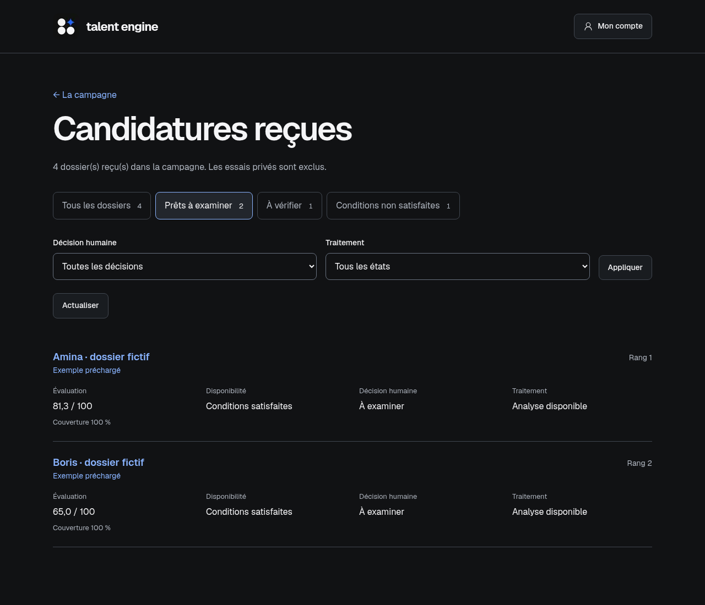

<p align="center">
  
</p>

<h1 align="center">Talent Engine</h1>

<p align="center">
  <strong>Des candidatures compréhensibles, une revue éclairée.</strong><br />
  Qualification explicable pour les programmes de formation et les recrutements.
</p>

<p align="center">
  <a href="docs/operations/local-runtime.md"><strong>Démarrer en local</strong></a>
  · <a href="docs/interface-gallery.md">Aperçu de l’interface</a>
  · <a href="docs/documentation-map.md">Documentation</a>
  · <a href="docs/evaluation/evaluation-engine-spec.md">Moteur d'évaluation</a>
  · <a href="docs/product/decision-register.md">Décisions</a>
</p>

Talent Engine aide un responsable à décrire une opportunité, recueillir des
candidatures et comprendre l'adéquation des dossiers à son besoin. Chaque
appréciation retrouve ses éléments justificatifs ; les informations manquantes
restent visibles, et la décision de sélection appartient au responsable.

Le projet est préparé pour le mini-challenge développeurs SKULLVI du Human
Capital Program de GevConsulting. La démonstration cible une formation en
développement et un recrutement marketing junior.

## Aperçu de l’interface



[Parcourir les fonctionnalités en images](docs/interface-gallery.md) : campagnes,
formulaire public, revue des dossiers, preuves, corrections et historique.

Le MVP est exécutable en local. Les captures utilisent des dossiers fictifs ;
les barèmes sont des exemples à calibrer. L’analyse automatique nécessite une
passerelle IA configurée. Le [guide de démonstration](docs/testing/demonstrations.md)
distingue les résultats préchargés des analyses réellement exécutées.

## Démarrer en local

Docker Compose est requis. Copier `.env.example` vers `.env`, renseigner deux
secrets aléatoires distincts pour la base et CSRF ainsi que les identifiants du
responsable, puis :

```sh
docker compose build
make migrate
make seed-access
make up
make seed-demo
```

Ouvrir <http://localhost:3003>, se connecter, créer puis publier une campagne.
Son lien public permet un dépôt ; le dossier est consultable dans l’espace privé.
Le seed crée aussi deux campagnes fictives et sept résultats préchargés,
explicitement identifiés, sans appel modèle ni clé. Répéter le seed ne crée
pas de doublons. Pour une analyse réelle neuve, suivre le
[guide de démonstration](docs/testing/demonstrations.md).
`make down` conserve la base et le volume des documents.
Voir le [guide local](docs/operations/local-runtime.md) pour les prérequis,
origines, limites du proxy local et tests. Les secrets restent hors Git.
L’appréciation automatique requiert une passerelle FreeLLMAPI configurée côté
worker, selon la [procédure serveur](docs/integrations/local-freellmapi.md).

## Parcours disponible

```text
Créer une campagne et préciser les exigences
  → publier un formulaire adapté
  → enregistrer durablement une candidature
  → extraire documents, portfolios et dépôts GitHub fournis
  → apprécier les critères avec des éléments sourcés
  → consulter admissibilité, couverture et score éventuel
  → corriger une appréciation et prendre une décision humaine
```

La création guidée, les formulaires publics, la collecte des sources,
l’appréciation sourcée et la consultation des résultats sont livrés.
Les corrections historisées, décisions indépendantes, relances versionnées et
la suppression durable sont également disponibles.
Les pages exigeant JavaScript ne sont pas rendues ; la lecture ciblée des
dépôts ne suffit pas à établir une contribution personnelle.

L'IA aide à extraire et apprécier les informations. Le backend possède les
politiques et calcule les scores. Une information absente n'est pas une note
zéro ; une panne d'analyse ne fait pas disparaître la candidature. Les scores
s'interprètent dans une campagne et servent à organiser la revue.

## Stack et organisation

| Élément | Choix retenu |
| --- | --- |
| Interface | Next.js, React et TypeScript |
| Métier et API | FastAPI et Python |
| Base de données | PostgreSQL |
| Dépôt | Monorepo avec `apps/web/` et `apps/api/` |
| Direction visuelle | Thème sombre, identité « Signal » |

La [structure détaillée](docs/architecture/repository-structure.md) et
l'[architecture système](docs/architecture/system-architecture.md) fixent les
responsabilités, pnpm/uv, les versions cibles et le worker Python avec tâches
PostgreSQL. Les commandes des fondations sont décrites dans le guide local ;
le worker persistant partage le package API et le volume privé des documents.

```text
assets/brand/    Logos, symboles, icône d'application et manifest
docs/           Produit, évaluation, architecture, design et décisions
apps/web/       Frontend Next.js et primitives accessibles
apps/api/       API FastAPI, campagnes, réception, documents, worker et migrations
```

FreeLLMAPI est intégré côté serveur pour l’appréciation, l’OCR et les vecteurs,
avec trois réglages séparés. Les parcours réels conservent citations et
provenance. Les appréciations varient et restent à calibrer ; aucun coût nul
n’est promis. Voir le [choix des adaptateurs](docs/integrations/ai-adapters.md)
et la [procédure serveur](docs/integrations/local-freellmapi.md).

## Documentation

- [Aperçu de l’interface](docs/interface-gallery.md) : captures des principales fonctionnalités.
- [Démonstrations](docs/testing/demonstrations.md) et [recette du MVP](docs/testing/acceptance-and-reference-cases.md) : modes, sources et preuves exécutées.
- [Cadrage produit](docs/product/project-overview.md) et [exigences du MVP](docs/product/mvp-requirements-and-acceptance.md) : objectifs, parcours et périmètre.
- [Analyse initiale](docs/product/project-analysis.md) : points solides et contrats à préciser.
- [Spécification du moteur](docs/evaluation/evaluation-engine-spec.md) : états, calcul et cas de référence.
- [Registre des décisions](docs/product/decision-register.md) : choix retenus et arbitrages ouverts.
- [Identité visuelle](docs/design/visual-identity.md) et [assets de marque](docs/design/brand-assets.md).
- [Carte documentaire](docs/documentation-map.md) : navigation et documents à produire.

## Licence

Aucune licence de réutilisation n'est définie à ce stade.
