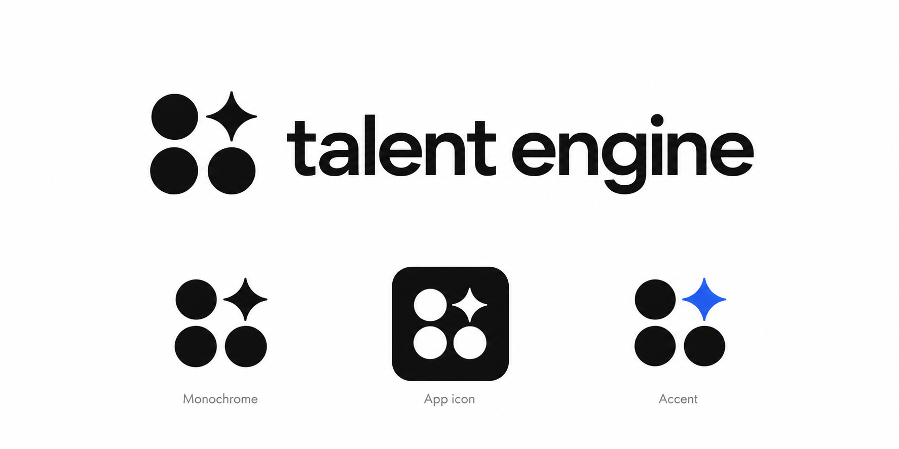

# Talent Engine — Direction visuelle

**Date :** 2026-10-03  
**Statut :** préférence pour le sombre et référence d'identité fournies ;
sept PNG générés et inspectés dans un aperçu navigateur. Système détaillé
proposé ; écrans produit et contrastes UI non vérifiés.

## 1. Intention

Le mainteneur écarte le clair comme thème principal. La proposition de travail
est un thème sombre par défaut, calme et lisible, conservant la sobriété,
les formulaires simples et la précision du cadrage initial.

Le mode clair secondaire reste à décider. Le sombre doit couvrir le dashboard,
la création guidée, le formulaire public et la fiche de candidature. Un aperçu
de formulaire utilise le même thème et les mêmes composants que la page publique.

## 2. Logo et icône : direction « Signal »

Le mainteneur fournit cette image comme inspiration pour le logo et l'icône.
La référence originale est conservée sans modification dans le dépôt :

### Éléments observés

- Un symbole en grille 2 × 2 : trois cercles et une étoile à quatre branches
  incurvées dans le quadrant supérieur droit.
- Un wordmark « talent engine » en minuscules, avec une typographie sans
  empattement grasse et un espacement compact.
- Une variante monochrome noire.
- Une icône d'application : symbole blanc dans un carré noir à coins arrondis.
- Une variante d'accent : seule l'étoile devient bleue.

Lecture proposée : le symbole évoque un signal identifiable au sein d'un
ensemble de profils. Cette interprétation relie l'identité à la qualification
documentée et à l'organisation de la revue ; elle reste une proposition de
sens, pas une signification confirmée par le mainteneur.

### Déclinaisons proposées pour l'interface sombre

| Usage | Proposition |
| --- | --- |
| Signature principale | Symbole et wordmark blanc cassé sur surface anthracite. |
| Variante d'accent | Cercles et wordmark blanc cassé ; étoile bleue. |
| Navigation compacte | Symbole seul ; conserver sa grille et l'étoile en haut à droite. |
| App icon | Carré anthracite arrondi avec symbole clair et marge optique régulière. |
| Favicon | Symbole seul, adapté après vérification à 16 et 32 px. |
| Fond clair ponctuel | Déclinaison noire visible dans la référence. |

Le bleu de marque peut guider l'accent UI déjà proposé. Sa valeur exacte et
ses variantes de contraste restent à déterminer sur les surfaces sombres.
La police exacte du wordmark n'est pas identifiée ; Geist Sans reste la
proposition pour les textes d'interface.

### Règles de production et de vérification

Le livrable final devra contenir un symbole et un wordmark vectoriels,
une variante monochrome, une variante d'accent et les exports d'icône utiles.
Le PNG fourni sert de référence de composition. Le [jeu de PNG générés](brand-assets.md)
contient les variantes utilisables et leurs limites ; les fichiers vectoriels
finaux restent à produire.

Préserver la grille, les trois cercles, le quadrant de l'étoile et la simplicité
des aplats. Ajuster optiquement la taille de l'étoile, les espaces entre formes
et la relation symbole/wordmark. Vérifier que les pointes et les intervalles
restent distincts à petite taille.

Le symbole est un élément de marque. Les icônes d'action conservent leur
vocabulaire Lucide et les états de sélection utilisent des libellés explicites.
Les PNG ont été inspectés de 16 à 64 px lors de la revue. Privilégier au moins 24 px
pour le symbole dans l'application ; la finesse de l'étoile devient moins
distincte à 16 px. Le contraste sur les surfaces produit finales reste à vérifier.

## 3. Rôles visuels proposés

| Rôle | Direction |
| --- | --- |
| Fond général | Anthracite profond ; éviter une page entière en noir pur. |
| Surface de contenu | Niveau légèrement plus clair, tables et formulaires lisibles. |
| Surface flottante | Niveau distinct pour menus, dialogues et aperçus de preuve. |
| Texte principal | Blanc cassé. |
| Texte secondaire | Gris clair dont le contraste sera mesuré sur chaque surface. |
| Bordure | Séparation visible des champs et lignes utiles, sans quadrillage excessif. |
| Action principale | Surface claire avec texte sombre. |
| Accent | Bleu sobre pour sélection, focus et liens. |
| États | Vert, ambre ou rouge avec texte explicite ; couleur toujours accompagnée. |
| Typographie | Geist Sans ; Geist Mono pour les rares valeurs où il aide à comparer. |
| Icônes | Lucide, cohérentes et associées à une action ou un état. |
| Mouvement | Court et discret, compatible avec la réduction des animations. |

Les couleurs exactes, tokens shadcn/ui, rayons, espacements et densité restent
à fixer sur des écrans représentatifs. Les documents PDF et images gardent
leurs couleurs d'origine dans une zone de consultation adaptée.

## 4. Écrans de référence

- Création de campagne : exigences simples, questions éditables, sauvegarde visible.
- Formulaire public : une colonne, champs lisibles sur mobile, erreurs précises.
- Tableau : score final ou état partiel, admissibilité et décision distincts.
- Fiche candidat : critères, justification et ouverture d'extraits sourcés.

La lisibilité d'une ligne partielle ou d'une erreur est aussi importante que
le rendu du dashboard rempli. Éviter les badges IA omniprésents, effets de
verre, dégradés décoratifs et graphiques sans utilité de revue.

## 5. Acceptation à exercer lors de l'implémentation

Vérifier le thème sur les quatre écrans, clavier et mobile ; mesurer les
contrastes ; exercer focus, erreurs, état désactivé, menus et consultations de
preuve. Une palette décrite dans ce document ne prouve pas ces comportements.

## 6. Fondations implémentées

Les tokens sont définis dans `apps/web/src/styles/tokens.css`. Les pages
d’accueil, connexion et espace responsable utilisent Geist local, Lucide et
les assets Signal existants. Les boutons, champs, alertes et dialogues sont
partagés ; le dialogue de compte utilise Radix pour le focus et le clavier.

Sur le runtime Compose : connexion réelle, erreur d’identifiants, déconnexion,
piège de focus, Échap et retour de focus ont été exercés. Aucun débordement
horizontal sur l’espace responsable à 320, 768, 1024 et 1440 px ; connexion et
dialogue également inspectés à 320 px. La réduction des mouvements désactive
les transitions des boutons. Ces vérifications ne couvrent pas encore les
quatre écrans métier futurs ci-dessus.
