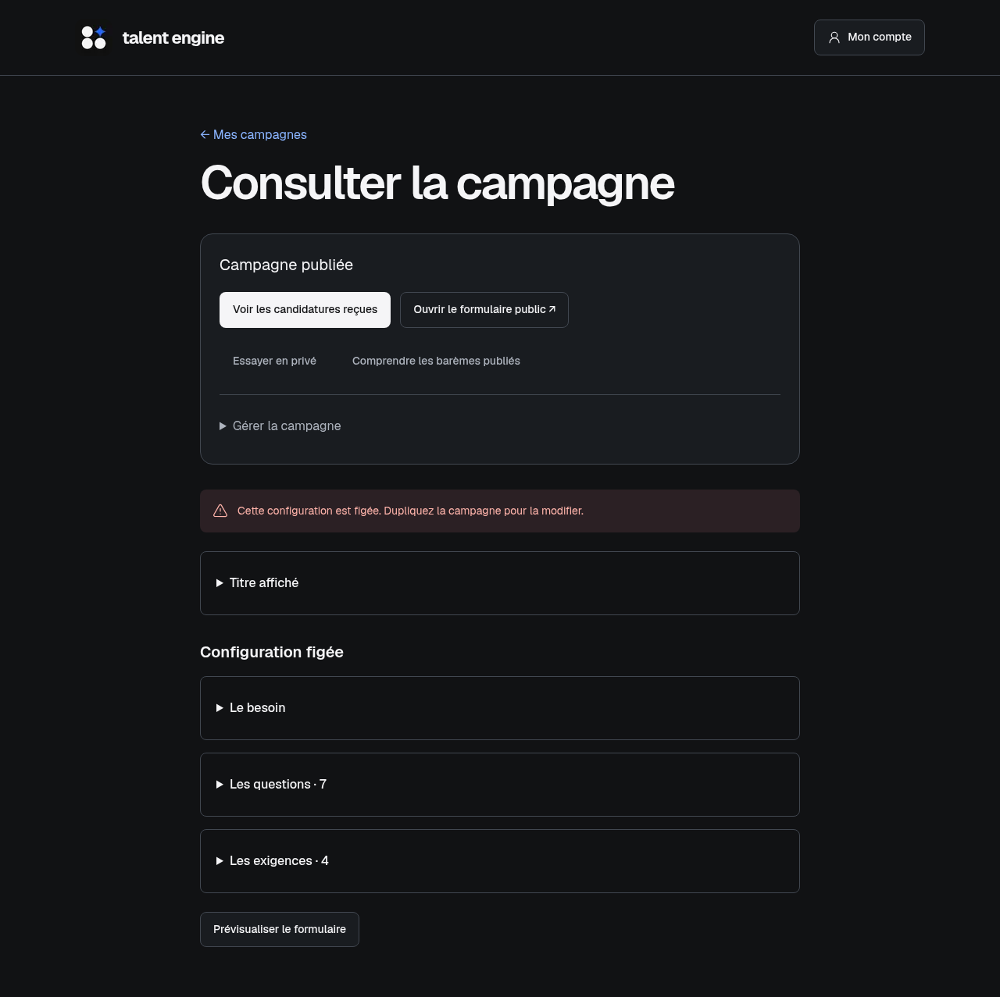
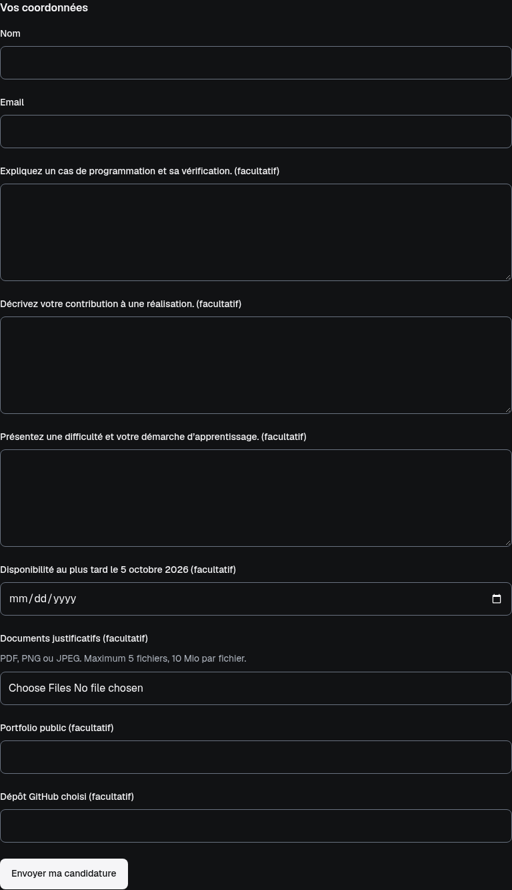
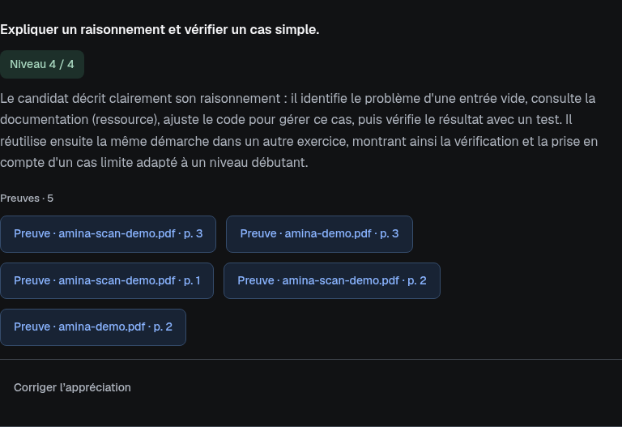
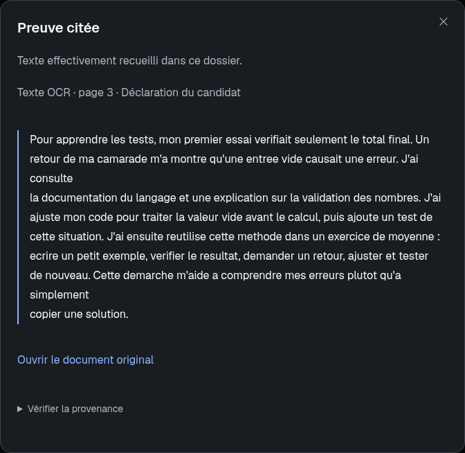
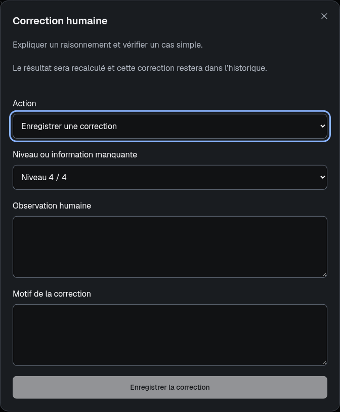
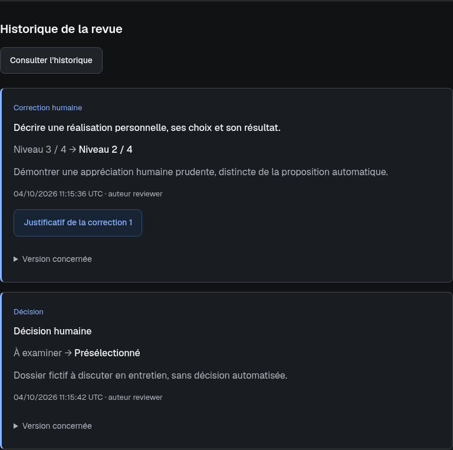
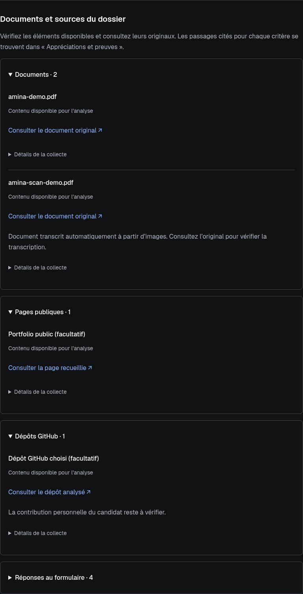

# Aperçu de l’interface

[← Présentation du projet](../README.md) · [Démarrer en local](operations/local-runtime.md)

Captures de l’application locale au 4 octobre 2026, en thème sombre. Les
candidats, réponses et documents présentés sont fictifs. Les campagnes
préchargées illustrent la revue ; certaines captures du dossier Amina montrent
une analyse réellement exécutée sur ces données de démonstration. Les références
publiques de portfolio et GitHub sont distinctes des profils fictifs.

## Parcours en images

- [Campagne publiée](#campagne-publiée)
- [Formulaire public](#formulaire-public)
- [Revue des candidatures](#revue-des-candidatures)
- [Appréciations et preuves](#appréciations-et-preuves)
- [Consultation d’une preuve](#consultation-dune-preuve)
- [Correction humaine](#correction-humaine)
- [Historique de la revue](#historique-de-la-revue)
- [Documents et sources](#documents-et-sources)

## Campagne publiée

Les candidatures et le formulaire public sont accessibles depuis la campagne.
Après le premier dépôt réel, le besoin, les questions et les exigences se
consultent en lecture seule. La duplication permet de préparer une autre campagne.

## Formulaire public

Le candidat renseigne ses coordonnées, ses réponses et les pièces demandées.
Un envoi sur ce formulaire crée une vraie candidature. La prévisualisation
accessible au responsable permet de vérifier le formulaire sans déposer de dossier.

## Revue des candidatures

Les files distinguent les dossiers prêts à examiner, les points à vérifier et
les conditions non satisfaites. Score, couverture, disponibilité et décision
humaine restent séparés. Le classement concerne les dossiers prêts à examiner.

## Appréciations et preuves

Chaque critère présente un niveau, son explication et les preuves à consulter.
Les libellés indiquent la source et, pour un document, la page. L’action de
correction est séparée des boutons de consultation.

## Consultation d’une preuve

La fenêtre affiche le passage recueilli, sa nature et son origine. Le document
original et les détails de provenance permettent de vérifier l’appréciation.

## Correction humaine

Le responsable peut corriger le niveau ou signaler une information insuffisante,
avec une observation et un motif. Le résultat effectif est recalculé ; les poids
publiés et l’analyse automatique originale restent conservés.

## Historique de la revue

Les changements conservent l’ancienne valeur, la nouvelle, le motif, la date et
l’auteur. Une correction d’appréciation et une décision de sélection sont deux
événements distincts.

## Documents et sources

Les documents, pages publiques, dépôts GitHub et réponses sont regroupés par
type. L’état de lecture, les liens vers les originaux et les détails de collecte
permettent de comprendre les éléments disponibles dans le dossier.

Les captures donnent un aperçu de l’interface ; les résultats et limites des
vérifications sont détaillés dans la [recette du MVP](testing/acceptance-and-reference-cases.md).
